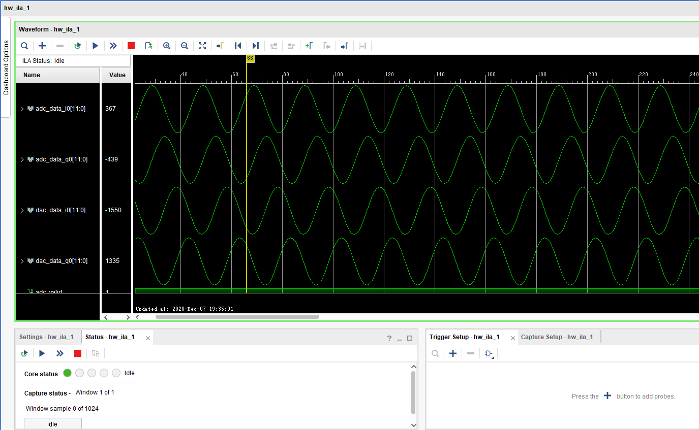

# SDR Project  

This is my repository for SDR study based on ad936x. In the next  several months, I will try to make it work.

The First Thing to do is  reading the ADI user guide.

## First step is done

In the first step,  I write a verilog module to send and receive data with ad9363 by the cmos interface in 1r1t mode.

And use the no-OS driver from Analog Device.  

[Analog Devices](https://github.com/analogdevicesinc/no-OS)

By now I can test the pluto in a bare metal way. In the first, I choose to set digital loop bist register to test my verilog interface module,and it looks works OK.  

In the next step, I use the RF loop bist register to test signal could loop throgh antenna, the result is fine.

Finally， I can send the signal generated by xilinx dds IP core, and loop throgh antenna. 

## What to do next

In the next steps, I wish I could do some ASK, FSK, PSK and other modulation or demodulation demo. The final goal is to implement a SDR plotfrom Firmware. 
